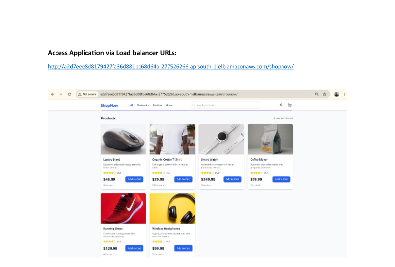
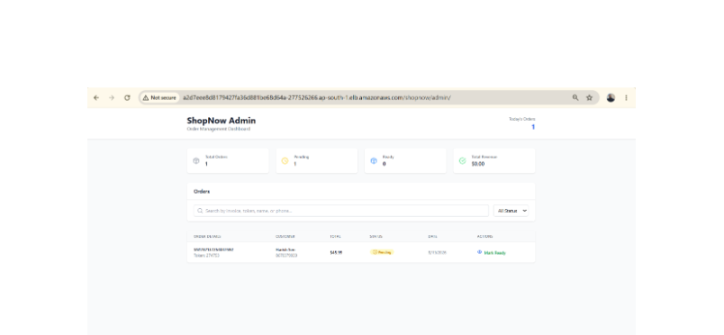

# ShopNow

ShopNow is a full-stack e-commerce capstone project. Customers can browse products, use a cart, place an order, and receive a collection token. Administrators can find orders, update their status, confirm collection, and view sales information.

## Project at a glance

| Component | Technology | Purpose |
|---|---|---|
| Customer app | React 18, Nginx | Catalog, cart, checkout, order confirmation |
| Admin app | React 18, Nginx | Order management and dashboard |
| Backend | Node.js, Express, Mongoose | REST API and business logic |
| Database | MongoDB 7 | Products, users, and invoices |
| Delivery | Docker, Jenkins, ECR, EKS | Build and deploy the application |

## Architecture

```text
Customer  -> Customer React application --\
                                            -> Express REST API -> MongoDB
Admin     -> Admin React application -------/
```

### How it works

1. The customer or administrator opens the application.
2. React displays the interface and sends requests to `/api`.
3. Express validates each request and runs the business logic.
4. Mongoose reads or updates MongoDB.
5. The backend returns JSON and React updates the page.

### Order flow

```text
Customer selects products
  -> Customer app sends checkout details
  -> Backend creates the invoice
  -> MongoDB saves the order and updates stock
  -> Customer receives an order and collection token
  -> Administrator finds the order
  -> Administrator updates its status
```

## Main features

- Browse and filter the product catalog
- Add products to a shopping cart
- Submit checkout details and create an invoice
- Generate an order collection token
- View customer orders by email
- Search and manage orders from the admin application
- Update order and payment status
- View product and order analytics

## Project structure

```text
shopNow/
|-- frontend/          # Customer React app
|-- admin/             # Administrator React app
|-- backend/           # Express REST API
|-- docker-compose.yml # Local environment
|-- Jenkinsfile        # CI/CD pipeline
|-- deploy-aws-eks.*   # EKS deployment scripts
`-- README.md
```

## Run with Docker

### 1. Clone the project

```bash
git clone https://github.com/harishmsgit/shopNow.git
cd shopNow
```

### 2. Start all services

```bash
docker compose up --build -d
docker compose ps
```

### 3. Open the applications

| Service | URL |
|---|---|
| Customer app | <http://localhost:3000> |
| Admin app | <http://localhost:3002> |
| Backend health | <http://localhost:5000/api/health> |
| MongoDB from the host | `mongodb://localhost:27018/shopnow` |

### 4. Test the API

```bash
curl http://localhost:5000/api/health
curl http://localhost:5000/api/products
curl http://localhost:5000/api/categories
curl http://localhost:5000/api/analytics/dashboard
```

### 5. View logs or stop

```bash
docker compose logs -f backend
docker compose down
```

## Run without Docker

Start MongoDB locally, then use a separate terminal for each component:

```bash
# Backend
cd backend
npm ci
cp .env.example .env
npm start
```

```bash
# Customer app
cd frontend
npm ci
npm start
```

```bash
# Admin app
cd admin
npm ci
npm start
```

On PowerShell, use `Copy-Item .env.example .env`. Set a valid `MONGODB_URI` in the backend `.env` file.

## Main API endpoints

Base URL: `http://localhost:5000/api`

| Method | Endpoint | Purpose |
|---|---|---|
| `GET` | `/health` | Backend health |
| `GET/POST` | `/products` | List or create products |
| `PUT/DELETE` | `/products/:id` | Update or delete a product |
| `POST` | `/invoices` | Create an order |
| `GET` | `/invoices` | List or search orders |
| `GET` | `/invoices/token/:token` | Find an order by token |
| `PUT` | `/invoices/:id/status` | Update order status |
| `PUT` | `/invoices/token/:token/collect` | Confirm collection |
| `GET` | `/users/:email/orders` | Customer order history |
| `GET` | `/analytics/dashboard` | Dashboard totals |
| `GET` | `/categories` | Product categories |

## Deployment flow

```text
Code commit
  -> Jenkins builds ShopNow
  -> Docker images are created
  -> Images are pushed to Amazon ECR
  -> Images are deployed to AWS EKS
  -> Kubernetes checks application health
```

The companion [HeroVired Infrastructure](https://github.com/harishmsgit/herovired-infra) project provisions EKS and deploys the three application images.

## How ShopNow, AWS, EKS, Nginx, and infrastructure work together

```text
shopNow code + herovired-infra configuration
  -> Jenkins pipeline
  -> Amazon ECR stores the ShopNow images
  -> Terraform creates AWS EKS
  -> Kubernetes runs the ShopNow containers
  -> AWS Load Balancer receives user traffic
  -> Nginx Ingress selects frontend, admin, or backend
  -> Backend connects privately to MongoDB
```

### Deployment flow

1. The `shopNow` repository contains the customer UI, admin UI, backend, and Dockerfiles.
2. The `herovired-infra` repository contains Terraform, Ansible, Kubernetes manifests, and the infrastructure pipeline.
3. Jenkins builds three ShopNow images: `frontend`, `admin`, and `backend`.
4. Jenkins pushes those images to Amazon ECR.
5. Terraform creates the AWS network, IAM permissions, and Amazon EKS cluster.
6. Kubernetes pulls the ShopNow images from ECR and starts the pods in `shopnow-ns`.
7. Kubernetes Services give the pods stable internal addresses.
8. The Nginx Ingress Controller receives traffic from the AWS load balancer and sends it to the correct service.

### Live request flow

| Request | Nginx ingress destination | Result |
|---|---|---|
| Customer application path | `frontend-service:80` | Container Nginx serves the compiled customer React app |
| Admin application path | `admin-service:80` | Container Nginx serves the compiled admin React app |
| API path | `backend-service:5000` | Express processes the API request |

For an API request, the full path is:

```text
Browser
  -> AWS Load Balancer
  -> Nginx Ingress Controller
  -> backend-service:5000
  -> Express backend pod
  -> MongoDB service:27017
  -> JSON response back to the browser
```

The frontend and admin containers also use Nginx to serve the compiled React files and provide single-page-application routing. MongoDB is an internal service and is not exposed through the public load balancer.

## Command reference

Run these commands from the `shopNow` repository root unless a different folder is shown.

### Local Docker commands

```bash
# Validate, build, and start
docker compose config
docker compose build
docker compose up -d
docker compose ps

# Follow logs
docker compose logs -f backend
docker compose logs -f frontend
docker compose logs -f admin
docker compose logs -f mongo

# Restart one service
docker compose restart backend

# Stop the application
docker compose down
```

`docker compose down -v` also deletes the local MongoDB volume. Use it only when local data can be removed.

### npm commands

```bash
# Backend
npm --prefix backend ci
npm --prefix backend start

# Customer app
npm --prefix frontend ci
npm --prefix frontend start
npm --prefix frontend run build

# Admin app
npm --prefix admin ci
npm --prefix admin start
npm --prefix admin run build
```

### Local API commands

```bash
API_BASE_URL=http://localhost:5000/api

curl -fsS "$API_BASE_URL/health"
curl -fsS "$API_BASE_URL/products?page=1&limit=20"
curl -fsS "$API_BASE_URL/categories"
curl -fsS "$API_BASE_URL/invoices?page=1&limit=20"
curl -fsS "$API_BASE_URL/analytics/dashboard"
```

### Git checks before a commit

```bash
git status --short
git diff --check
git diff --stat
```

## Verified local execution result

The project was built and run locally on 22 August 2026 with Docker Engine `29.5.2` and Docker Compose `v5.1.4`.

Command executed:

```bash
docker compose up --build -d
docker compose ps
```

Sanitized result:

```text
SERVICE    STATUS    HEALTHY    HOST ACCESS
frontend   running   yes        http://localhost:3000
admin      running   yes        http://localhost:3002
backend    running   yes        http://localhost:5000
mongo      running   yes        mongodb://localhost:27018/shopnow
```

HTTP and database verification:

```text
GET http://localhost:3000/             -> HTTP 200
GET http://localhost:3002/             -> HTTP 200
GET http://localhost:5000/api/health   -> HTTP 200

{"status":"OK","message":"ShopNow API is running"}

GET /api/products                     -> 6 products
GET /api/categories                   -> ["electronics","fashion","home"]
GET /api/analytics/dashboard          -> 0 orders and 0 revenue on the fresh database
MongoDB shopnow.products count        -> 6
```

Two local compatibility fixes were verified during execution:

- Host port `27018` maps to MongoDB container port `27017` because host port `27017` was already used by another local project.
- Docker Compose gives the backend the alias `backend-service`, allowing the same Nginx upstream name to work locally and in Kubernetes.

### Actual local command output

Command:

```bash
docker compose ps
```

Actual output:

```text
NAME               SERVICE    STATUS                 PORTS
shopnow-frontend   frontend   Up (healthy)           0.0.0.0:3000->80/tcp
shopnow-admin      admin      Up (healthy)           0.0.0.0:3002->80/tcp
shopnow-backend    backend    Up (healthy)           0.0.0.0:5000->5000/tcp
shopnow-mongo      mongo      Up                      0.0.0.0:27018->27017/tcp
```

Command:

```bash
curl -i http://localhost:5000/api/health
```

Actual output:

```http
HTTP/1.1 200 OK
Content-Type: application/json; charset=utf-8

{"status":"OK","message":"ShopNow API is running"}
```

Command:

```bash
curl http://localhost:5000/api/categories
```

Actual output:

```json
["electronics","fashion","home"]
```

Command:

```bash
curl http://localhost:5000/api/analytics/dashboard
```

Actual output from the fresh local database:

```json
{
  "totalOrders": 0,
  "pendingOrders": 0,
  "readyOrders": 0,
  "collectedOrders": 0,
  "totalRevenue": 0,
  "todayOrders": 0
}
```

Command:

```bash
docker exec shopnow-mongo \
  mongosh --quiet --eval "db.getSiblingDB('shopnow').products.countDocuments({})"
```

Actual output:

```text
6
```

Command:

```bash
curl -o /dev/null -s -w '%{http_code}\n' http://localhost:3000/
curl -o /dev/null -s -w '%{http_code}\n' http://localhost:3002/
```

Actual output:

```text
200
200
```

## Access ShopNow through the AWS Load Balancer / ALB

The ingress-controller Service owns the AWS load-balancer hostname. Retrieve it dynamically instead of copying an old address from a screenshot.

### 1. Connect to the EKS cluster

```bash
aws sts get-caller-identity
aws eks update-kubeconfig --region ap-south-1 --name shopnow-app-eks
kubectl cluster-info
```

### 2. Get the load-balancer hostname

```bash
export LB_HOST=$(kubectl get service \
  -n ingress-nginx ingress-nginx-controller \
  -o jsonpath='{.status.loadBalancer.ingress[0].hostname}')

echo "$LB_HOST"
```

PowerShell:

```powershell
$LB_HOST = kubectl get service `
  -n ingress-nginx ingress-nginx-controller `
  -o jsonpath='{.status.loadBalancer.ingress[0].hostname}'

$LB_HOST
```

If the output is empty, run `kubectl get service -n ingress-nginx ingress-nginx-controller -w` and wait for AWS to assign an address.

### 3. Open each application route

The deployed base path is `shopnow`:

| Page | Address |
|---|---|
| Customer application | `http://<LB_HOST>/shopnow/` |
| Admin application | `http://<LB_HOST>/shopnow/admin/` |
| API health check | `http://<LB_HOST>/shopnow/api/health` |

Bash verification:

```bash
curl -I --max-time 15 "http://$LB_HOST/shopnow/"
curl -I --max-time 15 "http://$LB_HOST/shopnow/admin/"
curl -fsS --max-time 15 "http://$LB_HOST/shopnow/api/health"
curl -fsS --max-time 15 "http://$LB_HOST/shopnow/api/products"
```

PowerShell browser access:

```powershell
Start-Process "http://$LB_HOST/shopnow/"
Start-Process "http://$LB_HOST/shopnow/admin/"
Invoke-RestMethod "http://$LB_HOST/shopnow/api/health"
```

### 4. Check routing when a URL does not work

```bash
kubectl get ingress -n shopnow-ns -o wide
kubectl describe ingress -n shopnow-ns
kubectl get service,endpoints -n shopnow-ns
kubectl get pods -n shopnow-ns -o wide
kubectl logs -n ingress-nginx deployment/ingress-nginx-controller --tail=200
kubectl logs -n shopnow-ns deployment/backend --tail=200
```

The current manifests use the Nginx Ingress Controller. AWS may provision a Classic Load Balancer or Network Load Balancer for that Service depending on its annotations and cluster configuration. An AWS Application Load Balancer specifically requires the AWS Load Balancer Controller and an ALB-backed Ingress.

### Verified AWS access result - 22 August 2026

```text
Customer route /shopnow/             -> HTTP 200
Admin route /shopnow/admin/          -> HTTP 200
API route /shopnow/api/health        -> HTTP 200
API response                         -> {"status":"OK","message":"ShopNow API is running"}
```

The hostname is intentionally not fixed in this README. Retrieve the current value with the command above because AWS load-balancer addresses can change.

Commands:

```bash
curl -o /dev/null -s -w '%{http_code}\n' "http://$LB_HOST/shopnow/"
curl -o /dev/null -s -w '%{http_code}\n' "http://$LB_HOST/shopnow/admin/"
curl -i "http://$LB_HOST/shopnow/api/health"
```

Actual output:

```text
200
200

HTTP/1.1 200 OK
{"status":"OK","message":"ShopNow API is running"}
```

## Who accesses each ShopNow application

| User | Route | What the user can do |
|---|---|---|
| Customer | `http://<LB_HOST>/shopnow/` | Browse products, use the cart, checkout, and receive a collection token |
| Administrator | `http://<LB_HOST>/shopnow/admin/` | Search orders, update status, confirm collection, and view dashboard totals |
| API user/tester | `http://<LB_HOST>/shopnow/api/...` | Call health, products, invoices, categories, users, and analytics endpoints |
| Platform operator | AWS, Jenkins, and kubectl access | Deploy and troubleshoot the application; does not use the customer UI for operations |

### Customer access

```bash
curl -I "http://$LB_HOST/shopnow/"
```

The load balancer forwards the request to Nginx Ingress, which sends it to `frontend-service:80`. Nginx inside the frontend container serves the compiled React customer application.

### Administrator access

```bash
curl -I "http://$LB_HOST/shopnow/admin/"
```

Nginx Ingress sends this route to `admin-service:80`, where the admin container serves the React admin application.

### API access

```bash
curl -fsS "http://$LB_HOST/shopnow/api/health"
curl -fsS "http://$LB_HOST/shopnow/api/products"
curl -fsS "http://$LB_HOST/shopnow/api/categories"
curl -fsS "http://$LB_HOST/shopnow/api/analytics/dashboard"
```

API traffic goes directly from Nginx Ingress to `backend-service:5000`. The Express backend communicates with MongoDB through the private `mongo:27017` Service.

> Current capstone behavior: customer and admin are separate interfaces and paths, but this repository does not show production-grade admin authentication or role-based authorization. Do not expose administrative or mutating API routes publicly in production until authentication and authorization are implemented.

## Screenshots

### Project architecture


### Customer application



### Admin application



The screenshots above were cropped to exclude personal and secret demo values from the original POC evidence.

## Notes consolidated from `docs/`

This README now contains the useful project information that was previously split across the documentation folder:

### Application contract

- The application repository owns the React and Express source, Dockerfiles, dependency lockfiles, and API behavior.
- The infrastructure repository owns AWS, EKS, ingress, Kubernetes manifests, secrets integration, and monitoring.
- The frontend and admin use `REACT_APP_API_BASE_URL` to reach the `/api` endpoint.
- The backend listens on port `5000` and uses `MONGODB_URI` for durable data.
- A release produces separate immutable frontend, admin, and backend images.

### Data and order rules

- Products contain catalog, price, category, rating, image, and stock information.
- Invoices contain customer, item, total, payment, and fulfillment information.
- Invoice numbers and collection tokens are unique.
- Valid order states are `pending`, `ready`, `collected`, and `cancelled`.
- Collecting an order changes its status to `collected` and payment to `paid`.

### Deployment approach

1. Jenkins installs dependencies from the committed lockfiles.
2. React production builds and the backend image are created.
3. The three images are tagged with a release or Git commit.
4. Images are pushed to Amazon ECR.
5. The infrastructure pipeline deploys them to EKS.
6. Backend health, application routes, and Kubernetes rollout status are checked.

### Quick troubleshooting

| Problem | Check |
|---|---|
| UI opens but data does not load | Backend logs, port `5000`, and `REACT_APP_API_BASE_URL` |
| Backend cannot connect to MongoDB | `MONGODB_URI`; use `mongo` inside Docker and `localhost` from the host |
| Product catalog is empty | Call `/api/products` and confirm MongoDB contains product data |
| React page returns 404 after refresh | Nginx SPA fallback and the configured application base path |
| EKS application is unavailable | Pods, Services, ingress, rollout status, and namespace events |

## References

- [React](https://react.dev/)
- [Express](https://expressjs.com/)
- [MongoDB](https://www.mongodb.com/docs/)
- [Docker Compose](https://docs.docker.com/compose/)
- [Kubernetes](https://kubernetes.io/docs/)

## License

See [LICENSE](LICENSE).
